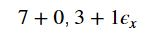
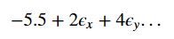
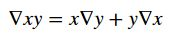
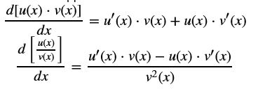
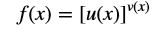
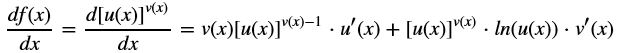
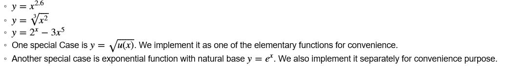
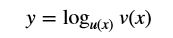
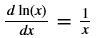
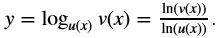

# AutoDiff

Developed by: Will Claybaugh, Bruce Xiong, Erin Williams  
Group #3, CS207 Fall 2018


## Introduction
Autodiff finds the derivatives of a function (to machine precision!) at the same time it finds the value of the function.
```
import autodiff.autodiff as ad

x = ad.DualNumber('x', 2)
y = ad.DualNumber('y', 3)

out = x/y
out.value # 0.66666, the value of 2 divided by 3
out.derivatives #{x: 1/3, y: -2/(3**2)}, the gradient of x/y at (2,3)
```
Autodiff works for functions and expressions with any number of inputs. Just pass those functions DualNumbers instead of regular ints/floats (and upgrade any math module functions to their autodiff equvalents)

## How to use autodiff

#### Installation
**Preferred method**: Autodiff is available on [PyPi](https://pypi.org/project/AutoDiff-group3/) and is pip installable. Use the command ```pip install AutoDiff-group3``` to install. It can easily be imported using ```import autodiff.autodiff as ad```.

Autodiff can also be installed installed by downloading from [github](https://github.com/cs207-project-erin-bruce-will/cs207-FinalProject). Becuase it has no dependencies, you can simply add the repo folder to your python path (```import sys
sys.path.insert(0, '/path_to_repo/')```) and import as normal. 

#### Usage
Using autodiff is very simple:
```
import autodiff.autodiff as ad

def f(a,b):
    return 3*a/b*ad.sin(a*b+2)

out = f(ad.DualNumber('x',2),ad.DualNumber('y',3))

print(out.value)
1.978716

print(out.derivatives['x'])
0.116358

print(out.derivatives['y'])
-1.24157

# get the value and derifative of f at a different point
out = f(ad.DualNumber('x',0),ad.DualNumber('y',1))
```

Autodiff works by defining dual numbers and then computing as usual. Built-in python operations are handled seamlessley, and operations imported from the math package (e.g. math.sin) must be replaced with thier Autodiff equivalents (e.g ad.sin in the example above). Any function that is passed dual numbers as input will return an Autodiff DualNumber object that stores the function's value and derivatives at the given point. Scalars are automatically promoted to DualNumbers as needed.


## Background
Dual numbers extend real numbers to include an infinitessemal component to represent the derivative in a given direction. Constants like 7 are dual numbers with zero derivative in a all directions, and (new) variables like x=3 are dual numbers with a value of 3 and a derivative in the x direction of 1 (and zero in all other directions).

The accurate, easy derivative information can be very useful in optimixation routines, such as Newton's method, or the stochastic gradient descent used to train neural networks.

A dual number can be written symbolically like  (the examples above), or include more directional derivatives: . This last result might come from math or code combining a dual number named x and a dual number named y.

When dual numbers add, subtract, divide, multiply, and more, the epsilons combine and distribute, but with the rule that the product of any two espilons is exactly 0 and disappears from the computation.

Autodiff works by overlading any existing mathematical operations to update the derivative information stored in each dual number at the same time it updates the value stored in the dual number.
  
## Software organization
Autodiff is organized as follows:

```
cs207-FinalProject/
	README.md 
	requirements.txt
	LICENSE
	setup.py
	setup.cfg
	*various hooks for pytest and travis*
	autodiff/
		autodiff.py
		__init__.py
		tests/
			*Various unit and integration tests*
	docs/
		Historic READMEs
		Demo.ipynb (a runnable demonstration of autodiff)
		documentation
		images/
			*Images used in documentation*
```

#### Modules
Autoiff has just one module: autodiff.py. It contains the DualNumber class and all its accesories.

#### Tests
Autodiff is tested via `pytest`. If you would like to run the tests yourself, run `pip install pytest` to download and install pytest. NOTE: this is only necessary for developers who will be editing the module. Those who simply want to use autodiff can skip this section

Note: installing `pytest` via `pip` will install it in the local environment. If you like to sandbox your development, start a virtual environment or conda environment before installing. (If that sentence did not make sense, consider whether you want to be missing with and testing this module. If you insist, the basic `pip install pytest` should be fine)

To run the tests, navigate to the repo folder (`cs207-FinalProject`) and run `python -m pytest`. This will run all files in the `\tests` folder.

You can run an individual set of tests via `py.test tests\filename`, for example, run just the integration tests via `py.test tests\integration_tests.py`. (If on a *nix system, update filepath separators as needed)

To contribute a test, refer to the [pytest documentation](https://docs.pytest.org/en/latest/contents.html) for instructions on how to structure the test.

Note that some test files are extremely repetitive and generated via a script. Changes made to `unary_tests.py` will not persist. Edit `write_unary.py` instead. 

	  
## Implementation details
The autodiff package is dead simple: there is a single module (`autodiff`) and a single class (`DualNumber`), along with autodiff package versions of functions in the `math` module, e.g `sin` and `log`. It has no external dependencies.

Any `DualNumber` has two components: a value and a dictionary of derivatives. The value is the real-number result of whatever computation returned this dual number. The derivatives are a dictionary mapping variable names to real numbers, for instance `{'x':3, 'y':0.2}`. This would mean that the computation that produced this dual number depends on original inputs named x and y (and no others) and the derivative in the x direction is 3, while the derivative in the y direction is 1/5. Importantly, dual numbers don't care how they were produced, and can be the result of arbitrarially complex user-defined functions. In fact, (soon) any function that is written in pure python can simply be called on `DualNumber` inputs to get the derivatives at those input values.

Dual numbers work by simply updating the present derivatives in each direction at the same time a new value is computed. For example, the product rule:  says "to make the output's derivatives: take the derivatives stored in y and multiply them by x's value, then add the derivatives stored in x multiplied by y's value".

Autodiff supports creation and basic manipulation of numpy arrays. It allows the user to substitute a numpy array for a single value, and will return derivatives at each position within the array. Currently, Autodiff support the dot product function and transpose function for numpy arrays.

In the event results are unstable -- that is, close to a branch -- Autodiff will continue to function, but return a warning so the user is aware of the potential issue.
  
#### "autodiff" Class Methods:
- We overload common operators such as `__add__`, `__sub__`, `__mul__`, and `__truediv__` and their commutative pairs `__radd__`, `__rsub__`, `__rmul__`, and `__rtruediv__`.
    - The basic rules for derivatives of multiplication and division are applied:
    
  
- We overload unary operator `__neg__`
- We also overload `__pow__` and `__rpow__`. We implement them as the general form below:
    

    - Therefore when we implement the derivatives, including the very special case such as ```y=x**2```, the following chain rule applies:
    	
    - The above basically covers most of the powers/ roots/ exponential functions, such as:
    	

#### Elementary Functions Implementation Details:
- General form of logarithm function:
	
    - We first implement a special case of the logarithm function with natural base: 
    - Then 
    - To get the derivatives, we just apply division rule.
    - We set up checks for domains of both base and exponent: both must be strictly positive to be meaningful.
    
- Trigonometric and anti-trigonometric functions:
    - `sin(x)`, `cos(x)`, `tan(x)`, `cot(x)`, `sec(x)`, `csc(x)`: the last four can be derived from `sin(x)` or `cos(x)`.
    - `arcsin(x)`, `arccos(x)`, `arctan(x)`, `arccot(x)`, `arcsec(x)`, `arccsc(x)`: essentially we only need to implement `arcsin(x)` and all other anti-trigonometric functions can be derived from `arcsin(x)`.
    - We set up checks for domain of `arcsin(x)` because it has to be between -1 and 1.    

## Extensions
The following are coming to autodiff very soon.
 - more robust support for Numpy arrays, giving the user the ability take an inverse of an array, subset arrays, etc.
 - better integration with basic Python functions, ie ad.Range() to be used where range() would be used
 - creation of a list object ie. as.list()


